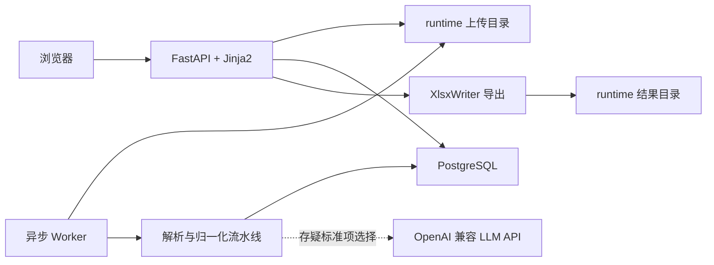

# 投诉判重系统运行与算法说明

## 1. 文档目的

本文说明当前版本投诉判重系统的实际运行方式、算法边界和运维方式。内容以仓库现有代码为准，主要面向业务复核人员、开发人员和部署维护人员。

当前系统不是“把每条工单与其他所有工单逐对比较”的程序，也不是 KMeans、DBSCAN 或大模型全量聚类系统。它采用以下主线：

```text
文件导入
  -> 规则解析
  -> 街道、地点/主体、核心问题归一化
  -> 强信号补充
  -> 按稳定事件键精确归组
  -> 无法可靠归组的工单保守生成单例事件
  -> 人工复核、剔除、重命名
  -> 全量 Excel 导出
```

核心目标是避免相似度传递造成的过度合并。例如，不能因为 A 与 B 相似、B 与 C 相似，就自动把 A、B、C 合成一个事件。

## 2. 系统总体架构



主要组件：

- Web 层：FastAPI、Jinja2、HTMX，负责上传、任务状态、事件查询、人工操作和下载。
- Worker：独立后台进程，负责读取文件、解析、归一化、分组和提交。
- 数据库：生产环境使用 PostgreSQL；SQLite 仅用于本地开发和自动化测试。
- 模型接口：通过 `httpx.AsyncClient` 调用 OpenAI 兼容的 `/v1/chat/completions`。
- 导出：XlsxWriter 生成结果，临时文件写入 `runtime/corpus_results`，避免容器 `/tmp` 空间不足。
- 部署：Docker Compose 分为 `migrate`、`api`、`worker` 三个服务。

当前主流程不使用 Milvus、Embedding、Rerank、jieba、KMeans 或 DBSCAN。

## 3. 三种业务入口

系统前端只提供三种导入入口。

### 3.1 历史库冷启动

用途：首次建立历史库，或用新的完整历史文件替换当前历史库。

输入：历史文件 B。

处理顺序：

1. 创建一个状态为 `building` 的新语料库代次（generation）。
2. 将历史文件解析到新代次，旧活动历史库继续可用。
3. 从历史数据生成并发布该代次使用的街道、锚点和问题标准项。
4. 生成历史事件及事件成员。
5. 无法构造完整事件键的工单生成独立单例事件。
6. 提交批次后，将新代次切换为 `active`，原活动代次改为 `archived`。

只有新历史库完整处理成功后才切换活动代次。处理失败时，新代次标记为 `failed`，不会破坏旧活动库。

当前词典审核属于后端内部步骤。Worker 会自动发布本次历史冷启动产生的标准项，前端不展示词典页面，也没有普通用户与管理员角色区分。

### 3.2 首次 A/B 联合比对

用途：系统第一次同时导入历史 B 和当天 A。

输入：历史文件 B、当天文件 A。

处理顺序：

1. 先按“历史库冷启动”完整处理 B。
2. B 成功建库并激活后，才读取 A。
3. A 使用刚建立的历史代次和标准项进行归一化、匹配和归组。
4. A 提交后，联合批次结束。

当天 A 不参与历史 B 的第一轮标准项抽取，因此不会反向改变 B 的初始建库结果。

### 3.3 每日新增

用途：活动历史库已存在时，只上传当天新增工单 A。

输入：当天文件 A。

处理顺序：

1. 读取当前活动历史代次及其标准项。
2. 解析 A 中的工单。
3. 优先匹配已有街道、锚点、问题和事件。
4. 存疑时可调用 LLM，从系统提供的候选标准项中选择。
5. 能命中已有事件的工单挂入已有事件；新组合建立新事件。
6. 仍无法可靠归组的工单建立单例事件。
7. 提交后，A 成为活动语料库的一部分，供下一次每日新增继续使用。

每日新增要求系统已有活动历史库。代码还会比较新增文件最早受理时间与历史库最大受理时间；发生时间范围重叠时会拒绝该批次，并提示重新建立历史库。

## 4. 文件导入与字段映射

支持格式：`.xlsx`、`.xls`、`.csv`。

当前读取规则：

- Excel 读取第一个工作表。
- CSV 自动识别 UTF-8，无法按 UTF-8 解码时使用编码检测结果，最终可回退到 GB18030。
- 必须自动识别出工单编号、诉求标题、市民诉求三个字段，否则批次失败。
- 受理时间、事项一至四级、最终事项分类等字段按别名自动匹配。
- 原始业务字段和值保存在 `raw_json` 中，用于事件详情和按原表结构导出。
- 名为 `Unnamed: 37` 的空脏列会被排除。
- 历史工单编号允许重复，数据库幂等键不是单独依赖工单编号，而是结合文件哈希、源行号和行哈希。

上传请求只保存文件并创建批次，不在 HTTP 请求中同步解析 Excel。文件读取由 Worker 执行，并通过 `asyncio.to_thread` 避免阻塞事件循环。

## 5. 规则解析

规则解析器版本当前为 `rules-v2`。

### 5.1 地址来源优先级

```text
市民诉求中首个“地址：...”行
  > 事发地点字段
  > 诉求标题
  > 无法识别
```

解析器不会在全文任意位置抓取第一个街道，以减少把承办部门、备注地点或其他上下文误认为事发地点的风险。

### 5.2 解析字段

解析结果包括：

- 地区、街道；
- 道路、门牌号；
- 楼栋、单元、房号；
- 商铺号、楼层；
- 地点或主体原文；
- 方位词；
- 锚点类型；
- 地址来源和解析置信度；
- 清洗后的诉求标题；
- 正文引用的历史工单号；
- 多事项分段。

街道会处理部分已知脏写法，例如“礼乐镇”归一为“礼乐街道”。楼栋和楼层中的部分中文数字也会转为统一数字形式。

### 5.3 主体与地标

如果地点名称包含“门口、后门、对面、附近、路口”等方位词，解析器倾向将其视为地标；否则有名称时默认视为主体。

方位、道路、门牌、楼栋、商铺和楼层会进入位置签名，用于阻止同品牌不同分店、同小区不同楼栋、同地点不同方向被轻易合并。

### 5.4 标题与电话

标题会去除部分前缀和通用词，例如 `[粤省心]`、地区括号、要求、咨询、反映、投诉、建议以及末尾的“问题/事项”。清洗后的标题只是辅助信号，不能单独跨地点合并。

电话分为：

- 完整 11 位手机号：保存为有效精确电话；
- 掩码号码：只保存掩码形态，不视为有效精确电话；
- 其他内容：视为无效。

电话不进入模型提示词中的向量计算，因为当前系统没有向量链路；电话也不能单独决定事件归属。

## 6. 标准项与归一化

系统在 PostgreSQL 中维护三类标准项：

- 标准街道；
- 标准锚点，即主体、地标、道路、社区或设施；
- 标准问题，即核心投诉事项。

这些标准项按词典版本保存，但不在前端展示。

### 6.1 历史冷启动归一化

历史冷启动会对全部历史记录执行：

1. 街道按地区和标准街道名去重。
2. 锚点先按街道、锚点类型和位置签名分组。
3. 小组内使用字符串归一化、通用主体后缀清洗、包含关系和 `SequenceMatcher` 进行保守别名合并。
4. 数字或方位存在硬冲突时禁止模糊合并。
5. 超过 200 个不同名称的大组不执行全量两两模糊比较，只执行精确名和去通用后缀后的安全归一。
6. 核心问题优先由规则从标题和正文识别；规则未命中时回落到事项四级、事项三级、最终事项分类或清洗标题。

代码中还包含针对已验证真实案例的后端审核规则，例如外海文化中心停车场、西屋厨房小家电、艾尚梵廷、明泰城状元居、德昌电机等。这些规则附带街道、道路、门牌、楼栋、楼层或方向限制，不是简单的全局字符串替换。

### 6.2 每日新增归一化

每日新增依次尝试：

1. 精确别名命中；
2. 在相同街道、锚点类型和位置签名范围内做保守模糊命中；
3. 问题名称的保守模糊命中；
4. 如仍存疑且启用 LLM，则从候选标准项中选择；
5. LLM 未通过阈值、调用失败或无候选时，建立当前批次的新标准项；
6. 最终仍不完整的记录生成独立单例事件。

LLM 不能自由发明标准项 ID，只能选择提示词中提供的候选 ID。模型返回后还要经过 Pydantic 结构校验、候选 ID 校验和置信度阈值校验。

## 7. 核心事件键

普通事件的逻辑身份为：

```text
活动历史代次
+ street_id
+ anchor_id
+ issue_id
+ occurrence_key
+ event_key_version
```

当前事件键版本为 `event-key-v2`。

其中：

- `street_id` 限定街道范围；
- `anchor_id` 表示标准地点或责任主体；
- `issue_id` 表示标准核心问题；
- `occurrence_key` 用于区分订单、投诉单或特定事实链；
- `event_key_version` 允许以后升级事件定义而不混用旧键；
- generation 隔离不同历史库代次。

事件名称由程序按以下信息拼接：

```text
地区｜街道｜道路门牌楼栋/商铺/楼层 + 地点或主体｜核心问题
```

人工可在事件详情中修改名称。修改只改变展示名称和审计版本，不改变事件的标准键。

## 8. 特定事实与强信号

### 8.1 订单号和投诉编号

正文中的明确订单号或投诉编号会生成：

```text
order:<标准化编号>
complaint:<标准化编号>
```

对于消费、退款、课程、会员、欠薪等容易出现“同商家但不同个人事件”的场景，如果没有明确编号，系统会对事项事实正文生成 `fact:` 指纹。这样可避免同一商家、同一问题类型下的不同消费者被直接合并。

同一个明确订单号或投诉编号如果已经形成多个事件，系统会选择确定的主事件归并相关工单，并将被归并事件标记为 `merged`。这是一条显式业务标识通道，不依赖相似度传递。

### 8.2 前序工单引用

只有在“工单、单号、编号、此前、之前、历史、重复”等上下文附近出现、并符合编号格式的值才会被识别为前序工单号。

如果引用编号能在同一历史代次内精确找到目标工单，且目标只指向一个事件，新增工单可挂入该事件。无法命中或同时指向多个事件时不会自动归并。

### 8.3 相同标题和相同电话

标题或有效电话只能在以下范围内作为强辅助信号：

- 同一历史代次；
- 同一街道；
- 同一核心问题；
- 道路、门牌、楼栋和方向一致；
- 至少存在门牌号或楼栋；
- 最终只能唯一指向一个事件。

因此，相同标题或相同电话不会跨街道、跨问题或跨明确地点冲突直接合并。

## 9. 为什么禁止传递合并

当前代码不使用并查集，也不根据相似边的连通性生成事件。

错误示例：

```text
A 与 B 地点写法接近
B 与 C 问题描述接近
不能据此推出 A、B、C 属于同一事件
```

系统只在标准街道、标准锚点、标准问题和事实范围共同确定后按键归组。不同键不会因为间接相似关系被合并。这是防止“大类滚雪球”的核心保障。

## 10. 保守单例策略

以下情况可能进入单例事件：

- 无法识别街道；
- 无法识别地点或主体；
- 无法识别核心问题；
- 存在多个候选但证据不足；
- 模型调用失败或模型置信度低于阈值；
- 解析到的新组合暂时没有可靠历史匹配；
- 人工从原事件中剔除并留空目标名称。

单例事件使用每条工单唯一的内部事件键，防止两个解析失败的记录因为相同兜底文字而误合并。系统的优先级是先控制误合并，再通过后续人工复核和规则优化降低漏合并。

## 11. 人工操作与审计

### 11.1 事件重命名

事件详情允许修改事件名称。每次修改都会：

- 增加事件修订号；
- 保存事件快照；
- 写入人工操作审计记录；
- 标记名称来源为人工。

### 11.2 剔除工单

从事件中剔除工单时：

- 输入已有事件名称：工单移动到该事件；
- 输入新名称：创建新事件并移动过去；
- 留空：创建带原事件名和工单标识的单例事件。

剔除后，系统会在该工单与原事件剩余成员之间写入永久 `cannot_links`，原因是“人工从事件中剔除”。原事件和目标事件的首末受理时间会重新计算，操作写入审计表并生成事件快照。

当前前端没有直接的“撤销剔除”按钮，但数据库保留快照、审计记录和 cannot-link 数据，便于后续实现回放或后台修正。

## 12. PostgreSQL 数据模型

核心表按职责分为五组。

### 12.1 语料库与批次

- `corpus_generations`：历史库代次及 active/building/archived/failed 状态。
- `corpus_sources`：上传文件、文件哈希、业务列和数据来源。
- `corpus_records`：原始工单、解析字段、归一化字段和 `raw_json`。
- `daily_batches`：任务状态、阶段、租约、进度和结果计数。
- `batch_records`：批次与工单关系，避免同一记录只能属于一个操作批次。

### 12.2 后端标准项

- `dictionary_versions`
- `dictionary_extraction_runs`
- `canonical_streets`、`street_aliases`
- `canonical_anchors`、`anchor_aliases`
- `canonical_issues`、`issue_aliases`
- `normalization_decisions`

### 12.3 事件

- `events`：事件键、名称、状态、代次、修订号和时间范围。
- `corpus_event_members`：工单到事件的一对一成员关系。
- `issue_mentions`：主问题和多事项分段。

### 12.4 关系约束

- `record_links`：前序工单等显式引用。
- `cannot_links`：人工或规则确认不可合并的工单关系。

### 12.5 审计

- `event_snapshots`：事件每次变更时的成员快照。
- `corpus_review_actions`：重命名、剔除等人工操作记录。
- `dictionary_review_actions`：后端标准项审核记录。

数据库查询默认限定当前 `active` generation。旧历史代次可以留作回滚和审计，但不进入当前事件库和当前导出。

## 13. 异步、并发与任务恢复

### 13.1 API 与 Worker 分离

生产环境 API 和 Worker 是两个容器：

- API 接收上传并创建 `uploaded` 批次；
- Worker 轮询并领取任务；
- 页面通过 HTTP/HTMX 查询任务状态；
- PostgreSQL 环境不在 API 进程内启动 Worker。

SQLite 开发模式可在 API 进程内启动轻量 Worker。

### 13.2 任务领取

Worker 使用数据库租约和 `FOR UPDATE SKIP LOCKED` 领取任务：

- 同一任务不会同时被两个 Worker 处理；
- Worker 定时更新心跳并延长租约；
- Worker 异常退出后，租约到期的任务可被重新领取；
- 可同时领取的批次数由 `DAILY_BATCH_CONCURRENCY` 控制；
- 同批领取的任务通过 `asyncio.TaskGroup` 并发运行。

主要阶段状态包括：

```text
uploaded -> parsing -> reviewing -> committed
```

联合比对还会使用 `awaiting_daily`，操作请求使用 `approval_requested`、`commit_requested`，失败状态为 `failed`。

### 13.3 模型并发

存疑归一化请求按 `NORMALIZATION_LLM_BATCH_SIZE` 分批，通过 `asyncio.gather` 并发发送；`LlmClient` 内部 Semaphore 将实际并发限制为 `NORMALIZATION_LLM_CONCURRENCY`。

HTTP 连接总数和长连接数分别由 `HTTP_MAX_CONNECTIONS`、`HTTP_MAX_KEEPALIVE_CONNECTIONS` 控制。HTTP 错误、无效 JSON 或结构校验失败会按 `LLM_MAX_RETRIES` 重试，并识别 `Retry-After`。

## 14. LLM 在系统中的准确职责

LLM 不是最终判重器，也不负责扫描全部历史工单。

它只处理每日新增中已经由规则缩小范围的存疑标准项：

- 输入：单条工单原文、地址、标题、分类，以及候选锚点和候选问题；
- 输出：候选 `anchor_id`、候选 `issue_id`、各自置信度和理由；
- 限制：只能选择现有候选 ID，不能新增或改写 ID；
- 校验：输出必须是指定 JSON 结构，且 ID 必须存在于候选集合；
- 门槛：低于 `NORMALIZATION_LLM_MIN_CONFIDENCE` 的选择被拒绝；
- 失败处理：记录失败决策，后续通过新标准项或单例事件保守处理。

因此模型波动不会直接把任意两个历史事件合并。真正的事件归组仍由程序化事件键和强信号约束完成。

## 15. 事件库前端

事件库默认展示当前活动代次中的活动事件，并支持：

- 地区筛选；
- 街道筛选；
- 核心事项筛选；
- 事件名称模糊搜索；
- 最近更新排序；
- 工单数从多到少或从少到多排序；
- 仅显示包含最新今日批次工单的事件；
- 隐藏只有一条工单的事件；
- 显示当前筛选范围内的事件总数和单条工单事件数；
- 每页 10 个事件；
- 点击事件名称查看全部成员工单，成员列表每页 10 条。

事件详情展示受理时间、所属部门、数据来源、工单编号、诉求标题和市民诉求，并提供重命名和剔除操作。

“工单数”表示当前事件的成员数量，不是候选对数量，也不是模型调用次数。

## 16. Excel 导出

导出范围是当前活动历史代次中已提交且仍属于活动事件的全部工单。

工作表：

- `重复项`：事件成员数大于 1；
- `孤立工单`：事件成员数等于 1。

格式规则：

- 第一列为`数据来源`，第二列为`事件名称`；
- 后续列保持历史源表业务字段及原始顺序；
- 同一事件的工单物理相邻；
- 事件之间交替使用浅蓝 `#EAF2FB` 和浅米 `#FFF8E7`；
- 黑色文字、冻结首行、自动筛选、自动换行；
- 以 `=`、`+`、`-`、`@` 开头的字符串增加前缀，避免 Excel 公式注入；
- 结果先按事件名称和事件 ID排序，再按受理时间和记录 ID 排序。

数据来源来自 `corpus_records.data_source`：历史冷启动记录为历史表，当天增量记录为当天新增。事件详情和导出均应使用数据库来源字段，而不是根据日期猜测。

## 17. 配置项

所有运行配置从 `.env` 加载，由 `src/complaint_dedup/config.py` 类型校验，并以只读 Settings 单例提供。

### 17.1 服务与数据库

```dotenv
APP_HOST=127.0.0.1
APP_PORT=8765
APP_TIMEZONE=Asia/Shanghai
DATABASE_MODE=postgresql
DB_HOST=...
DB_PORT=5432
DB_USER=...
DB_PASSWORD=...
DB_NAME=gongdan
DB_POOL_SIZE=10
DB_MAX_OVERFLOW=10
```

### 17.2 任务与租约

```dotenv
MAX_TOTAL_ROWS=200000
DAILY_BATCH_CONCURRENCY=2
JOB_LEASE_SECONDS=300
JOB_HEARTBEAT_SECONDS=30
```

约束：数据库基础连接池不能小于任务并发数；心跳间隔必须小于租约时间。

### 17.3 归一化模型

```dotenv
NORMALIZATION_LLM_ENABLED=true
NORMALIZATION_LLM_CONCURRENCY=2
NORMALIZATION_LLM_MIN_CONFIDENCE=0.90
NORMALIZATION_LLM_BATCH_SIZE=10

LLM_BASE_URL=...
LLM_API_KEY=...
LLM_MODEL=...
LLM_JUDGEMENT_MODEL=
LLM_TIMEOUT_SECONDS=90
LLM_MAX_RETRIES=2
LLM_TEMPERATURE=0
LLM_MAX_TOKENS=4096
LLM_ENABLE_THINKING=false
```

`LLM_JUDGEMENT_MODEL` 未设置时使用 `LLM_MODEL`。真实密钥只应存在于本机或服务器 `.env`，不得提交 Git、写入页面或输出到普通日志。

## 18. Docker 部署与更新

服务器目录结构：

```text
complaint-dedup-validator/
├── app/          # 挂载的代码
├── config/.env   # 真实配置和密钥
├── runtime/      # 上传文件、导出结果等运行数据
├── image/        # 镜像构建文件
└── compose.yaml
```

Compose 服务：

- `migrate`：执行 `alembic upgrade head`；
- `api`：对外提供 Web 界面；
- `worker`：后台执行批次。

当前映射端口为宿主机 `28765` 到容器 `8765`。普通代码更新可同步 `app/` 后重启容器；依赖、Python 环境或镜像构建文件变化时才需要重新构建镜像。数据库结构变化必须先执行 Alembic 迁移。

代码目录以只读方式挂载，`runtime` 单独可写。生产 API 和 Worker 不共享进程内状态，任务状态和事件结果全部以 PostgreSQL 为准。

## 19. 当前已知边界

以下是当前代码的真实边界，不应误解为已经具备的功能：

1. 当前只读取 Excel 的第一个工作表，没有前端工作表选择和手工字段映射。
2. 地址解析以江海区真实数据规则为重点，跨城市、复杂农村地址和无结构自由文本仍可能需要扩充规则。
3. 主体/地标分类目前主要依赖方位词，不能等同于完整的命名实体识别。
4. 标准问题由有限规则和源分类回落生成，未覆盖的新问题可能被分得过细或以标题作为问题名。
5. 每日新增中的新标准项会直接加入当前词典版本，当前没有前端人工审核门槛。
6. LLM 只做候选标准项选择，不会执行组级多工单推理，也不会输出最终重复/不重复结论。
7. 当前没有 pg_trgm、pgvector 或 Milvus 检索；模糊匹配使用进程内 `SequenceMatcher`。
8. 当前没有全量历史事件自动重算。历史冷启动替换活动代次；每日新增只追加到当前代次。
9. 人工剔除会写 cannot-link，但当前自动归组主路径尚未全面查询 cannot-link 作为所有后续批次的前置过滤条件；它主要承担审计和后续扩展基础。
10. 事件名称人工修改不会修改标准事件键；后续相同键记录仍归入原事件。
11. 受理时间使用 `datetime.fromisoformat` 解析，非标准日期字符串可能无法参与时间重叠检查和事件时间范围计算。
12. 每个上传文件单独检查 `MAX_TOTAL_ROWS`；首次联合比对不是按 A+B 合计行数限制。
13. 历史代次目前采用归档而非物理删除。若长期多次冷启动，需要配套数据库清理、备份和保留策略。
14. 系统优先避免误合并，因此无法确认的记录可能形成较多单例，需要通过黄金集持续补充解析规则和受审核别名。

## 20. 一条每日工单的完整示例

假设当天工单内容为：

```text
地址：江海区礼乐街道德昌电机门口
事项：下雨后道路积水，要求处理
```

程序执行：

1. 从“地址：”首行识别江海区、礼乐街道、德昌电机门口。
2. 识别“门口”为方位，锚点类型为地标。
3. 规则将核心问题归一为“道路积水”。
4. 在活动词典中查找礼乐街道下相同类型、相同位置签名的锚点。
5. 如果锚点和问题均命中，则得到完整事件键。
6. 如果同键事件已存在，工单直接加入该事件；否则建立新事件。
7. 如果锚点存在多个存疑候选，才调用 LLM 从候选中选择。
8. 如果证据仍不足，则建立单例事件，不与其他工单做传递合并。
9. 人工可进入事件详情核对原文，必要时剔除、移动或重命名。
10. 导出时该工单按事件成员数量进入“重复项”或“孤立工单”，并保留其数据来源。

## 21. 质量验证建议

每次修改算法后，不应只看事件数量，应至少检查：

- 所有已提交工单是否恰好属于一个事件；
- 是否存在活动空事件；
- 是否存在同一工单重复归属；
- 跨街道、同名异址、同品牌不同分店是否误合并；
- 同地点不同核心问题是否分开；
- 同订单号或明确前序工单是否正确收敛；
- 单例数量和人工剔除比例是否异常上升；
- 历史库替换失败时旧活动代次是否仍可访问；
- Excel 两个工作表的行数合计是否等于当前活动库已提交工单数；
- 导出列顺序、数据来源、事件名称、颜色、冻结首行和自动筛选是否正确。

重点真实回归案例应继续包含：德昌电机主体与门口地标、西屋同品牌多地点和多订单、外海文化中心停车场不同问题、艾尚梵廷别名、明泰城同地点多问题。
